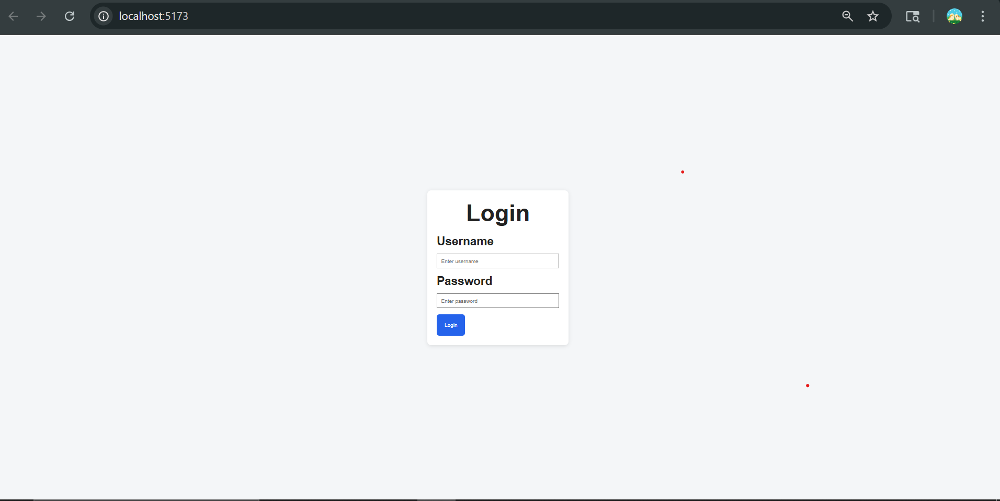
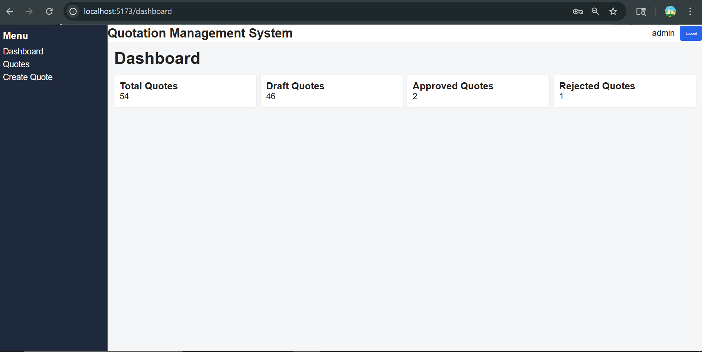

# Quotation_Management_System_CRM_Project2# 🚀 Quotation Management System (CRM Project)

## 📌 Overview

The Quotation Management System is a full-stack application that enables sales teams to create, manage, and track quotations efficiently. It supports role-based access, quotation lifecycle management, and analytics.

---

## 🏗️ Tech Stack

* **Frontend:** React.js, Axios, Tailwind CSS
* **Backend:** ASP.NET Core Web API
* **Database:** SQL Server (Entity Framework Core)
* **Authentication:** JWT (JSON Web Token)
* **Caching:** Redis
* **Deployment:** Docker

---

## ✨ Features

### 🔐 Authentication & Authorization

* JWT-based login system
* Role-based access control (Admin, Sales, etc.)

### 📄 Quotation Management

* Create, update, delete quotations
* Add multiple line items
* Automatic calculation (subtotal, tax, total)

### 🔁 Quote Lifecycle

* Draft → Sent → Viewed → Accepted / Rejected / Expired

### 📊 Analytics

* Quote analytics using Redis caching
* Performance optimization

### 🧪 Testing

* Unit testing for backend services
* Validation and error handling

### 🎨 Frontend

* Responsive UI using React
* API integration with backend
* Clean and user-friendly design

---

## 👥 Team Members

| Member Name | Responsibility           |
| ----------- | ------------------------ |
| Gautami     | Frontend & Deployment    |
| Sakshi      | Backend & Database       |
| Gauri       | Features, Redis, Testing |

---

## 📂 Project Structure

```
Quotation_Management_System_CRM_Project2/
│
├── Frontend (React)
├── Backend (ASP.NET Core API)
├── Tests
├── Docker Configuration
```

---

## ⚙️ Setup Instructions

### 🔹 Backend

```bash
cd QuotationManagementWebApi
dotnet restore
dotnet run
```

### 🔹 Frontend

```bash
cd quotation-management-ui
npm install
npm run dev
```

---

## 🐳 Docker Setup

```bash
docker-compose up --build
```

---

## 🔗 API Documentation

* Swagger UI available at:

```
http://localhost:5000/swagger
```
* Final UI :
```
https://lipolitic-renowned-cecil.ngrok-free.dev/
```

---

## 📸 Screenshots



---

## 📌 Future Enhancements

* Email notifications for quotes
* Advanced reporting dashboard
* Role-based UI improvements

---

## 📄 License

This project is developed for educational purposes.
